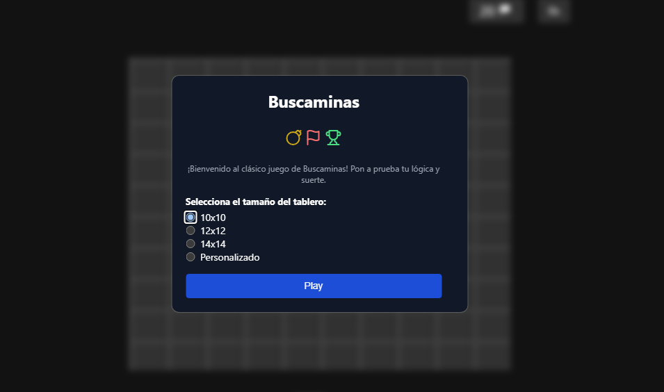
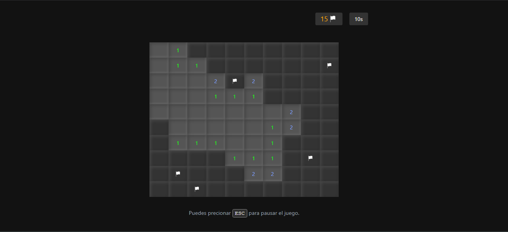
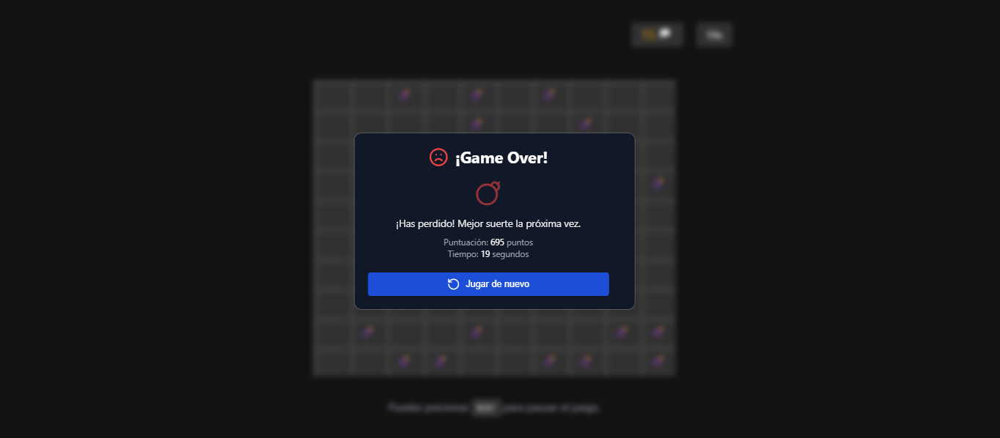

# Buscaminas

## ¡Bienvenido al clásico juego de Buscaminas!
Pon a prueba tu lógica y suerte con esta versión moderna del clásico juego, desarrollada completamente con **HTML**, **CSS** y **JavaScript**.

---

### Características principales:
- **Tamaño de tablero personalizable:**
  Elige entre varias opciones predefinidas (10x10, 12x12, 14x14) o configura tu propio tablero personalizado.
- **Interfaz intuitiva:**
  Diseño moderno, minimalista y responsivo.
- **Contador de tiempo:**
  Reta a tus amigos logrando el mejor tiempo.
- **Marcador de banderas:**
  Asegúrate de marcar las minas correctamente antes de hacer clic.

---

## Capturas de pantalla:

### Menú principal


### Juego en curso


### Game Over


---

## Tecnologías utilizadas:

- **HTML5:**
  Estructura semántica del juego.
- **CSS3:**
  Estilizado moderno con enfoque en flexibilidad y experiencia del usuario.
- **JavaScript:**
  Lógica del juego y manejo de eventos para una experiencia interactiva.

---

## Cómo jugar:

1. **Inicio:**
   Selecciona el tamaño del tablero que prefieras y presiona el botón "Play".
2. **Reglas:**
   - El objetivo es descubrir todas las celdas vacías sin hacer clic en una mina.
   - Los números en las celdas indican cuántas minas hay en las celdas adyacentes.
   - Usa banderas para marcar las celdas que creas que contienen minas.
3. **Final del juego:**
   - Si haces clic en una mina, pierdes.
   - Gana descubriendo todas las celdas sin minas lo más rápido posible.

---

## Instalación y uso:

1. Clona el repositorio:
   ```bash
   git clone https://github.com/Cristian-F-M/buscaminas.git
   ```
2. Abre el archivo `index.html` en tu navegador.
3. ¡Disfruta del juego!

---

## Autor

<div style="display: inline-flex; align-items: center;">
  
  <span style="margin-left: 10px;">Cristian Morales</span>
</div>

---

## ¡Contribuciones bienvenidas!
Si tienes ideas para mejorar este juego, no dudes en abrir un issue o enviar un pull request.
